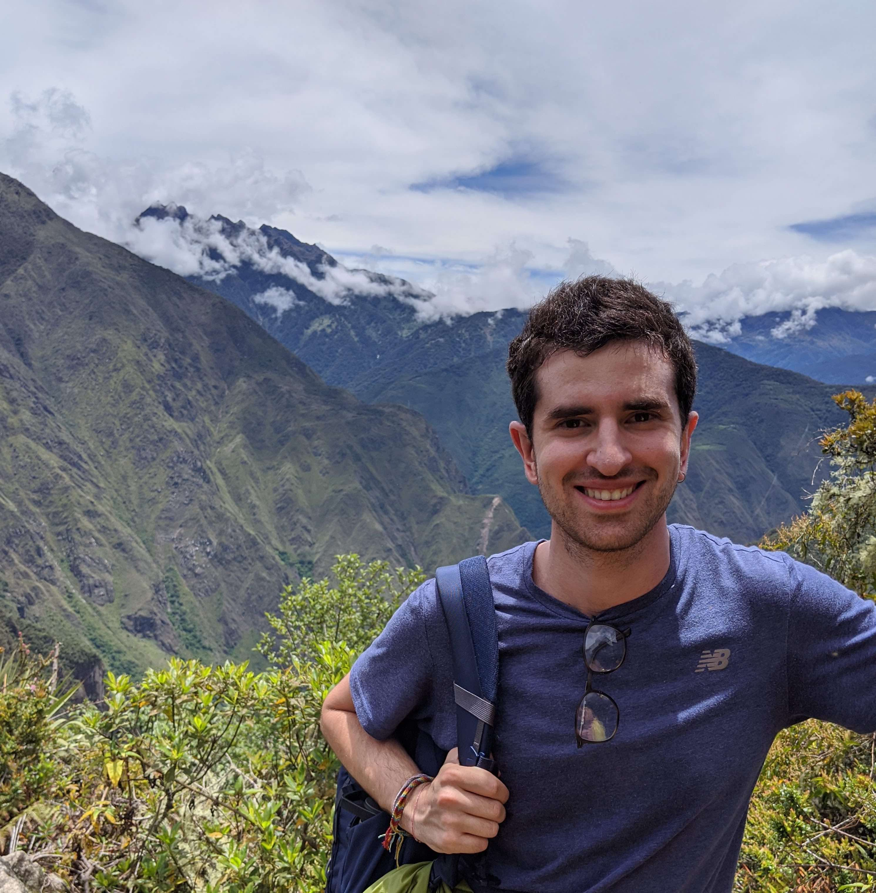
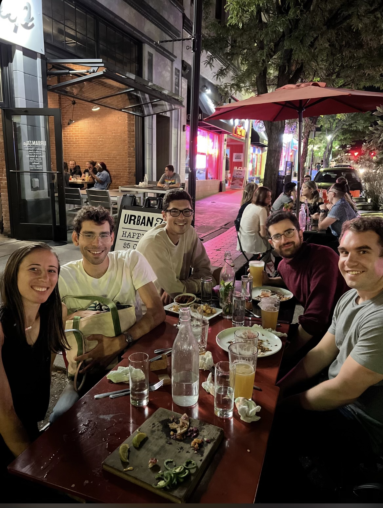

I was thrown into the world the Tuesday 21st of November of 1995, in Santiago, <a href="https://en.wikipedia.org/wiki/Chile">Chile</a>. As a result, my native language is Spanish, my nationality is Chilean, my favorite comedian is <a href="https://www.felipeavello.cl/">Felipe Avello</a>, and my favorite liquor is <a href="https://en.wikipedia.org/wiki/Pisco" >Pisco</a>. Also I forgot to mention that I was born as a member of <a href="https://en.wikipedia.org/wiki/Human">the most abundant and widespread species of primate</a>.

<figure style="text-align:center;">
  
  <figcaption>
    <b style="font-size: 18px;"> Picture 1: </b>
     A picture of me, a human being, in Machu Picchu (Perú).
  </figcaption>
</figure>

I grew up in Santiago, where I first attended the German school <a href="https://dsmorus.cl/">Deustche Schule Sankt Thomas Morus</a>. Because of how poorly I was doing at school (my German was terrible, and I had troubles with other kids), my parents helped me transfer to the Catholic school <a href="https://www.colegiosanfranciscodeasis.cl/csfda/">Colegio San Francisco de Asis</a>. After a first year where I also did poorly and got complains about my behavior, the next year everything changed. I became a Catholic, and for the first time started doing well academically and making good friends (I still talk to many of them today, and I love them!). As time went by, I went more and more into Catholicism, until the point of considering priesthood. Fortunately, I started being mentored by the amazing Chilean philosopher <a href="https://en.wikipedia.org/wiki/Roberto_Torretti"> Roberto Torretti</a>, from whom I basically learned all the philosophy I know today. He would suggest a book for me to read, and we would discuss it. This way, I read most of Plato, Aristotle, Leibniz, Spinoza, Hume, Kant, and others. The result of this process made me an atheist, and also oriented me towards the political left-wing. 

<figure style="text-align:center;">
  
  <figcaption>
    <b style="font-size: 18px;"> Picture 2: </b>
     A picture of (left-to-right) Chilean philosopher of science Roberto Torretti, Chilean actor Pedro Vicuña (my step-dad!), and me. The shirts were actually just a random coincidence!
  </figcaption>
</figure>

In my last year of high school our math teacher (thanks for everything Álvaro Sánchez!) invited 3 students to enroll for a robotics competition. Vicente Méndez (who is now a Geologist getting his Masters of Science, the most lucrative career in Chile given its prominent mining industry), Felipe Vergara (who is now a priest!), Eugenio Voticky (who is now a lawyer) and Bernardo Subercaseaux (who is me). We didn't know anything about robotics; there was no robotics lab in our school, we barely knew some trigonometry, and had learned how to use a soldering iron to build little metallic cubic houses. None of us knew any coding whatsoever. I didn't even know what "coding" was. I had never talked with a computer scientist. But in a surprising turn of events we went there and won the 1st place amongst all schools of Santiago (an 8 million people city!).

<figure style="text-align:center;">
  
  <figcaption>
    <b style="font-size: 18px;"> Picture 3: </b>
     My high school robotics team getting the first prize at the UNAB high school robotics competition 2013. We have (left-to-right) Vicente Méndez, Álvaro Sánchez, Felipe Vergara, Eugenio Voticky and me.
  </figcaption>
</figure>

I started college at the #1 university in Chile, <em><a href="https://portaluchile.uchile.cl/english"> University of Chile </a></em> (note how creative Chilean university naming is!), where I completely fell in love with Mathematics and Computer Science since my first semester. There I started being mentored by an amazing duo of young professors: <a href="https://scholar.google.com/citations?user=9OH3PokAAAAJ&hl=en">Pablo Barceló</a> and <a href="https://scholar.google.com/citations?user=a6lUuiwAAAAJ&hl=en">Jorge Pérez</a>.

Professor Jorge Pérez invited me to participate in *Competitive Programming* (i.e., solve as many algorithmic problems you can in a given period of time) since my first semester, and without any programming knowledge I started to compete, mostly contributing to my team from the mathematical side. So in that first semester, my team composed of 3 freshmen got the 3rd place in the National finals. Next year, we also participated and also got the 3rd place nation-wide. 

<figure style="text-align:center;">
  
  <figcaption>
    <b style="font-size: 18px;"> Picture 4: </b>
     The team "@Pérez y #LosFabulososMechones", which translates to "@Pérez and #TheFantasticFreshmen". Left to right: Professor Jorge Pérez, Robinson Castro, Lucas Cabello, and me. We got 3rd nationwide place that year.
  </figcaption>
</figure>

<figure style="text-align:center;">
  
  <figcaption>
    <b style="font-size: 18px;"> Picture 5: </b>
     My friend Robinson Castro and I competing on 2015. We also got 3rd place that evening.
  </figcaption>
</figure>

After 3 semesters, I was selected to participate in a <em>dual-degree</em> program in Paris, France. Moreover, I was the only Chilean of that year in getting the prestigious  <em><a href="https://www.campusfrance.org/en/eiffel-scholarship-program-of-excellence">Eiffel Scholarship</a></em>, which supported elite international students to study in France. A very minor setback was caused by the fact that I didn't know absolutely any French!

<figure style="text-align:center;">
  
  <figcaption>
    <b style="font-size: 18px;"> Picture 5: </b>
     My French class in Vichy, 2016. We have (left-to-right):  (South Korea, missing name), Yu Feng (China), Manuel Michael (Kenya), Xu Yuanxin (China),Xiaodu Yang (China), Pablo Uribe (Chile), Professor Karine (France), Nick (China, missing last name), (Germany, missing name), (China, missing name), Tokyo Kibata (Japan) and me (Chile).
  </figcaption>
</figure>

But I learned French, and many other things too, graduating with two bachelors and two master degrees, one from University of Chile and the other one from <em><a href="https://www.centralesupelec.fr/">CentraleSupélec</a></em> (former <em>École Centrale Paris</em>).

Before graduating, I had to come back to Chile, take a few classes and do a master thesis. That's how the French-Chilean dual-degree was structured. So I went back, and I wanted something better than a 3rd place in Competitive Programming. The problem is, ACM-ICPC competitions are limited by age, so I basically had my last opportunity to make it. Fortunately things turn out in my favor, and with a new team I got the 1st place in the TCP (Chilean Programming Tournament) twice in a row, while also winning the 1st place in Chile at the ACM-ICPC South American Finals. Also, that same year, we participated in the IEEEXtreme 12.0 and got the 29th place **worldwide**. Here are some pictures.

<figure style="text-align:center;">
  
  <figcaption>
    <b style="font-size: 18px;"> Picture 6: </b>
     My competitive programming team of 2018: "The GraceHoppers", in honor to the great Computer Scientist <a href="https://en.wikipedia.org/wiki/Grace_Hopper"> Grace Hopper</a>. Left to right: Professor Jorge Pérez, Thibault Swysen, me, and Robinson Castro.
  </figcaption>
</figure>

<figure style="text-align:center;">
  
  <figcaption>
    <b style="font-size: 18px;"> Picture 7: </b>
     Me in full-focus mode during the ACM-ICPC South American Finals of 2018.
  </figcaption>
</figure>

<figure style="text-align:center;">
  
  <figcaption>
    <b style="font-size: 18px;"> Picture 8: </b>
 The GraceHoppers obtaining 1st place.</figcaption>
</figure>

For my Chilean master thesis I worked with my mentors Pablo Barceló and Jorge Pérez on theoretical aspects of <em><a href="https://christophm.github.io/interpretable-ml-book/">Machine Learning interpretability.</a></em> 
My thesis obtained the maximum possible score, which implied the especial distinction that my grades will be overridden to make me graduate with a perfect GPA (7.0 in the Chilean scale). This thesis work <a href="https://portaluchile.uchile.cl/noticias/181898/estudiante-de-postgrado-dcc-gana-concurso-de-tesis"> won the 1st prize in the Latin American contest for master theses in Artificial Intelligence</a>, and resulted in 5 different papers at NeurIPS, a top conference in Machine Learning. One of these papers got distinguished as a <em>spotlight paper</em>, for being amongst the top 3% of the submissions that year.

<figure style="text-align:center;">
  
  <figcaption>
    <b style="font-size: 18px;"> Picture 9: </b>
     Screenshot of my master thesis defense happening on Zoom, during the Covid pandemic.
  </figcaption>
</figure>

<figure style="text-align:center;">
  
  <figcaption>
    <b style="font-size: 18px;"> Picture 10: </b>
     my much more fun in-person graduation in France. In the top row we have (left-to-right): Pati Gómez de Olea (Spain), Elena Kostaropoulou (Greece), Pablo Uribe (Chile), Paloma Gómez de Olea (Spain) and Ignacio Legarraga (Chile). In the bottom row: Daniel Da Costa (Brazil), Amine Chokairi (Morocco) and me.
  </figcaption>
</figure>

In the meantime, I did an internship at Facebook (now Meta), on the Oculus organization. I received great guidance (yet not absent of conflicts) from Mahdi Rahimi, and got a juicy return offer from Facebook to come back as a full time Software Engineer.

However, I wanted something more juicy than money: Math. So I enrolled in grad-school at Carnegie Mellon University (CMU) in August 2021, co-advised by <a href="http://www.cs.cmu.edu/~anupamg/">Anupam Gupta</a> and <a href="https://www.cs.cmu.edu/~mheule/">Marijn Heule</a>. I had an amazing first year in Pittsburgh, doing research, meeting new friends, and struggling through my coldest winter so far!

<figure style="text-align:center;">
  
  <figcaption>
    <b style="font-size: 18px;"> Picture 11: </b>
     Hanging out with my friends at Urban Tap, Pittsburgh. Left-to-right: Caroline Pellegrini, Alexander Goldberg, Alexander Wilf, me and Bailey Miller. Hiding behind the camera: Saranya Vijayakumar.
  </figcaption>
</figure>

On September 2022, I moved to Berkeley, California to participate in a program at the <em><a href="">Simons Institute</a></em> (UC 
Berkeley). 
After that time, I was struggling with having two different advisors with two completely disjoint projects, so I acknowledged the old bible verse: <em><a href="https://en.wikipedia.org/wiki/Matthew_6:24#:~:text=%E2%80%9CNo%20one%20can%20serve%20two,other.">"No one can serve two masters"</a></em>, and Anupam and I decided to become simply collaborators, while I am now solely advised by Marijn Heule.

<figure style="text-align:center;">
  
  <figcaption>
    <b style="font-size: 18px;"> Picture 12: </b>
     My advisor's research group attending the Federated Logic Coference (FLoC) 2022 in Haifa, Israel. From left to right: Evan Lohn, me, Marijn Heule, Joseph Reeves, Emre Yolcu and MD Solimul Chowdhury.
  </figcaption>
</figure>

We have arrived to the present tense, so the rest is to be written in the <em><a href="https://www.urbandictionary.com/define.php?term=Meatverse">meatverse</a></em> first. 

Before leaving, you can check the next section with miscellaneous data about me.

## Some more objective data about me

1. **Full name**: Bernardo Aníbal Subercaseaux Roa.
2. **Height**: 1.82cm, or 6 feet if you're into using feet to measure things.
3. **Zodiac Sign:** Scorpio.
4. **Degree of credence in the significance of Zodiac Signs:** 1.5 out of 10.
5. **Languages I'm fluent in:** Spanish, English, and French.
6. **Instruments:** Guitar.
7. **Favorite musician(s):** The Beatles.
8. **Favorite Beatle:** George Harrison.
9. **Favorite Philosopher:** Immanuel Kant.
10. **Favorite Mathematician:** probably Alan Turing.
11. **Favorite colors:** Green and purple.
12. **Favorite animals:** Monkeys, owls, otters, meerkats, manatees, axolotls, squirrels, raccoons, etc.
13. **Favorite painter:** Pablo Picasso.
14. **Favorite composer:** Claude Debussy.
15. **Favorite poet:** Wisława Szymborzka.
16. **Favorite writer:** Sorry, impossible to choose!
17. **Favorite programming language:** Python.
